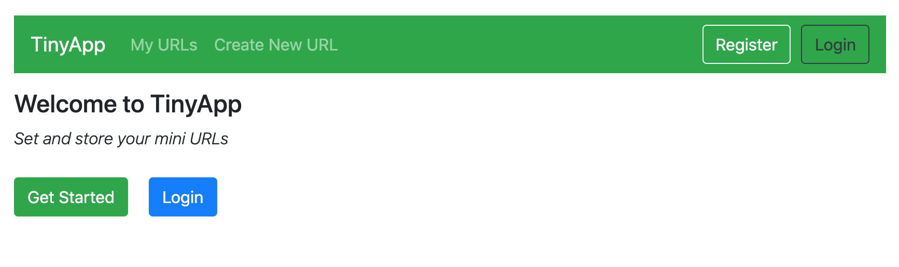
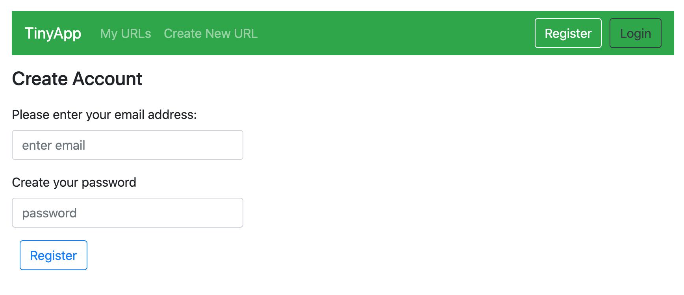
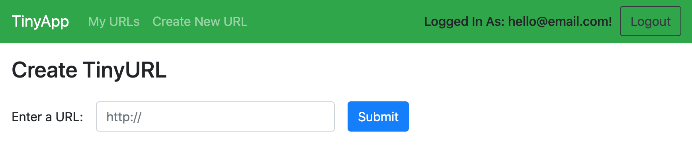
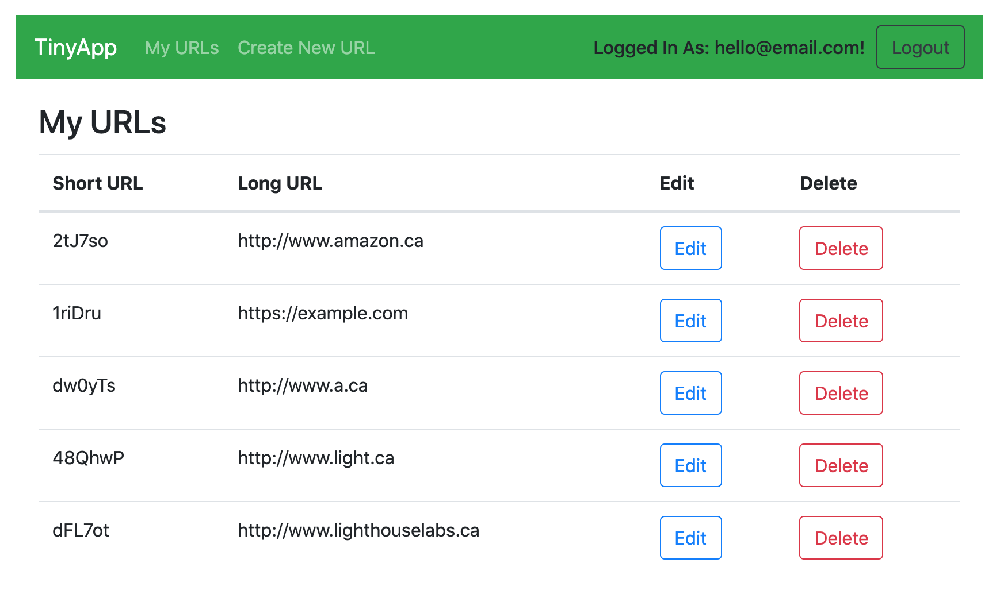
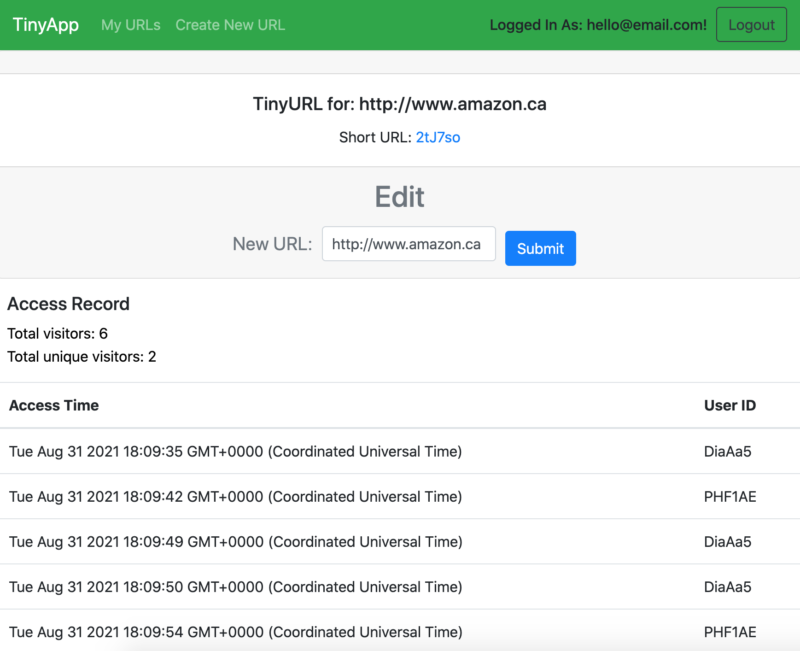

# TinyApp Project

Hello and welcome to TinyApp!

## Core Features
TinyApp was designed to allow you to create, track and update your condensed URLs. By creating an account, you can add URLs to create smaller URLs which redirect to the original - much more convienent for sharing links through bite sized communications! Your small URLs are recorded in a list, where you may access, edit, or delete them as needed.

## Security
TinyApp hashes passwords to securely manage your login details. 

## Analytics
TinyApp includes URL access analytics, which allows you to view the use statistics of your small URLs. This includes total visits, the number of unique visitors, and a record of the times and users that accessed your URLs. To view these, simply click on the edit button for the link. Access records are included at the bottom of the URL edit page. 

## Final Product

## Getting Set Up
To try TinyApp yourself, please follow the steps below:
- Clone the repository
- Run npm install
- Enter "node express_server.js" in your command line
- Open a browser and go to "http://localhost:8080/home" 
